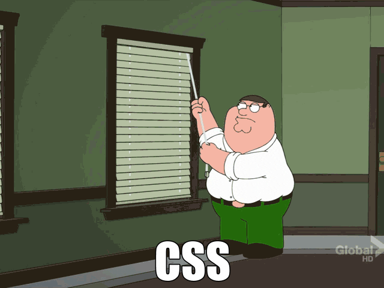

<link rel="stylesheet" href="style.css">

  <!--  -->
  
  

    
    
  
     
    
   <!--#  Hi World-->
  

<!-- 

  

 -->

## 👋 About Me

I am a full-stack developer with a strong focus on backend development.

My primary stack includes **PHP (Yii2, Laravel)**, and I also work with **Node.js** while actively learning **Go**. I develop web applications, API services, and integrations with external systems.

### ⚙️ Technologies & Tools

- **Backend:** PHP (Yii2, Laravel), Node.js
- **Frontend:** Vue.js 2/3, TypeScript, JavaScript
- **Databases:** MySQL, Redis, ClickHouse
- **Messaging & Queues:** RabbitMQ, NATS
- **DevOps:** Docker, CI/CD, Linux

### 💼 Experience

I have experience developing and maintaining large B2B projects in the real estate industry.

My responsibilities included implementing complex business logic, mortgage calculators, analytics systems, CRM and third-party service integrations, as well as performance optimization and application architecture design.

In addition to backend development, I actively work with frontend technologies, including Vue.js 2/3, TypeScript, and JavaScript. I have developed SPA applications, administrative panels, and user interfaces for commercial products.

### 🚀 Interests

I am interested in high-load systems, microservice architecture, distributed systems, and modern software development approaches.

I continuously learn new technologies and expand my technical stack.

### :hammer_and_wrench: Languages and Tools :

  &nbsp;
  &nbsp;
  &nbsp;
  &nbsp;
  &nbsp;
  &nbsp;
  &nbsp;
  &nbsp;
  &nbsp;
  &nbsp;
  &nbsp;
  

### :fire: My Stats :

 
  
  

